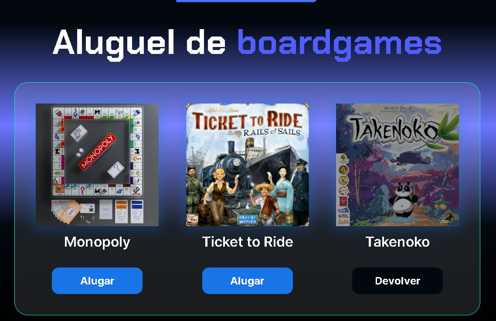

# Projeto ALUGAMES



## Descrição do projeto
Projeto feito para reforçar os conhecimentos básicos de Javascript, onde o desafio era fazer com que os botões de alugar e devolver funcionassem de acordo com o clique e disponibilidade do jogo de tabuleiro.

Também havia o desafio de mostrar um aviso quando se clica em devolver para não haver devoluções erradas e o desafio de mostrar quantos jogos foram alugados, onde optei por mostrar a quantidade no console.log();

## Linguagens utilizadas no projeto
<div>
  
  
  
</div>

## Como Executar

Para executar este projeto localmente, siga os passos abaixo:

1. **Clone o repositório:**
    
    ```bash
    git clone https://github.com/LeozinGs/javascript-alugames
    ```
    
2. **Navegue até o diretório do projeto.**
3. **Abra o arquivo `index.html` em seu navegador:**
    
    Basta dar um duplo clique no arquivo `index.html` ou abrir manualmente em seu navegador preferido.
